# Руководство: как пользоваться и как показывать

Две части. Первая — что делает каждая роль и куда нажимать. Вторая —
готовый сценарий показа жюри на трёх вкладках, по минутам.

Скриншоты сняты с рабочего приложения на демонстрационных данных.

---

## Часть 0. Запуск

```powershell
powershell -ExecutionPolicy Bypass -File scripts\run.ps1
```

Откроется `http://127.0.0.1:8000`. Остановка — **Ctrl + C** в том же окне.

Флаг `-ExecutionPolicy Bypass` обязателен: у Windows PowerShell 5.1 политика
по умолчанию `Restricted`, и без флага скрипт не запустится.

Полезные ключи: `-Reseed` пересоздаёт демонстрационные данные с нуля,
`-NoBrowser` не открывает вкладку автоматически.

---

## Часть 1. Как пользоваться

### Вход

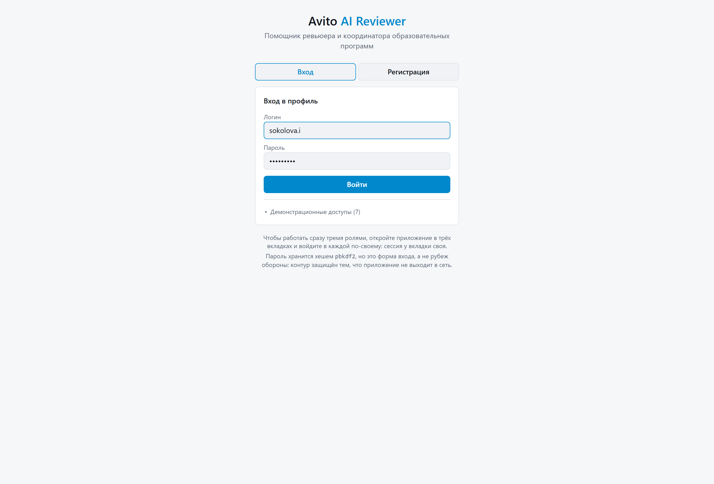

Логин и пароль. Роль определяется учётной записью — выбирать её на входе
нельзя, иначе методистом стал бы любой желающий.

Кнопка **«Демонстрационные доступы»** раскрывает список: имя, роль, логин.
Нажатие на строку подставляет логин в форму. Пароль у всех один и напечатан
там же.

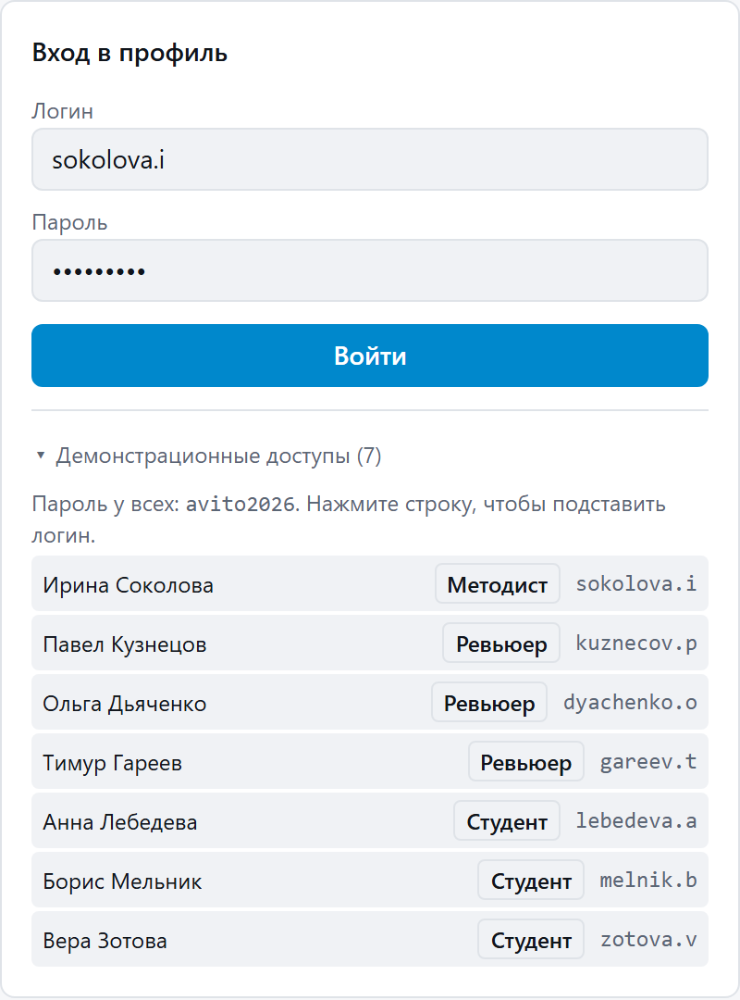

| Роль | Логин | Пароль |
|---|---|---|
| Методист | `sokolova.i` | `avito2026` |
| Ревьюер (продуктовый фрод) | `dyachenko.o` | `avito2026` |
| Ревьюер (QA и системный дизайн) | `gareev.t` | `avito2026` |
| Студент | `lebedeva.a` | `avito2026` |

Вкладка **«Регистрация»** рядом заводит новую учётную запись.

**Три роли одновременно** — три вкладки браузера. Сессия хранится в
`sessionStorage`, а он изолирован по вкладке: инкогнито не нужно. Сменить
роль внутри вкладки можно, нажав на имя пользователя в шапке.

---

### Методист

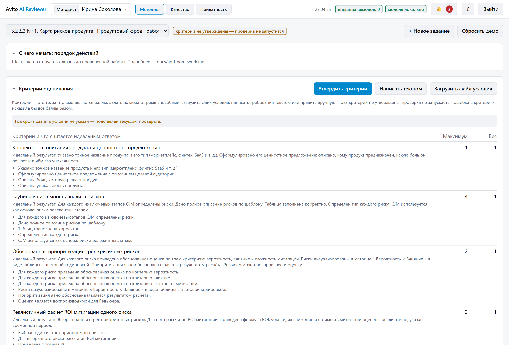

Экран длинный, поэтому первым блоком идёт напоминание о порядке действий.

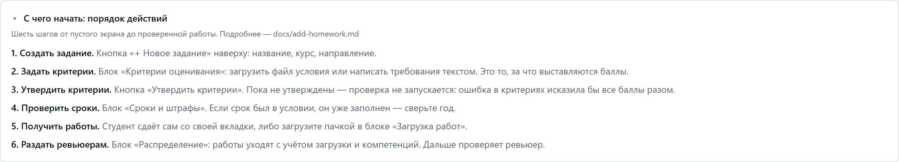

#### 1. Критерии оценивания

Главный блок. Критерии — это то, за что выставляются баллы; без них
проверять нечего.

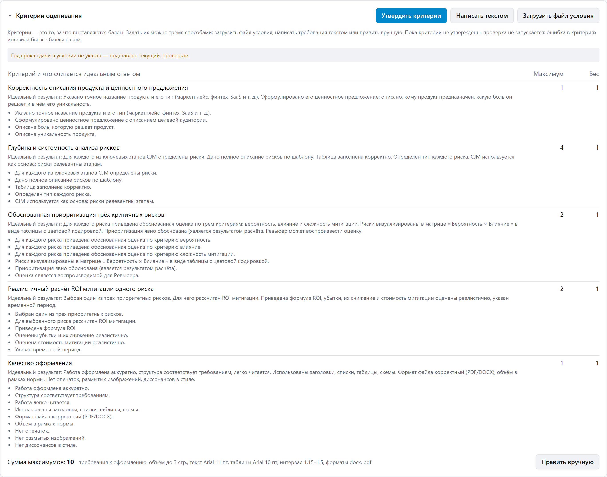

Три способа задать, все равноправны:

- **«Загрузить файл условия»** — основной путь. Принимаются `.pdf`, `.docx`,
  `.md`, `.txt`. Система вытащит названия критериев, максимальные баллы,
  требования к оформлению, срок сдачи и правило штрафа. Числа берёт код
  регулярными выражениями, названия — модель.
- **«Написать текстом»** — когда файла условия нет. Вставьте условие как
  есть или напишите список «Критерий (2 балла)».
- **«Править вручную»** — точечная правка в JSON.

Дальше — **«Утвердить критерии»**. Пока не утверждены, проверка не
запускается вовсе: ошибка в критериях исказила бы баллы всех работ разом.
Любая правка сбрасывает утверждение.

#### 2. Загрузка работ

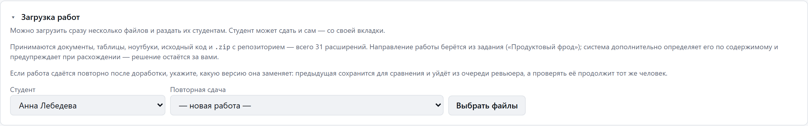

Выбрать студента и один или несколько файлов. Работы студент может сдавать
и сам — со своей вкладки.

Принимается 31 расширение: документы, таблицы, ноутбуки, исходный код,
`.zip` с репозиторием.

#### 3. Сроки и штрафы

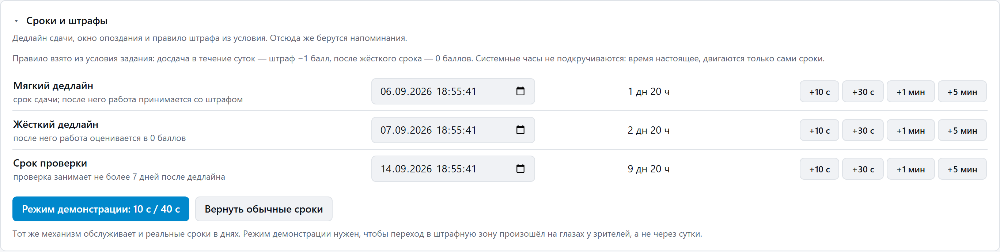

Три момента времени: срок сдачи, окно опоздания (после него работа
оценивается в ноль) и срок проверки.

**«Режим демонстрации: 10 с / 40 с»** сдвигает сроки так, чтобы переход в
штрафную зону произошёл на глазах у зрителей, а не через сутки. После показа
нажмите **«Вернуть обычные сроки»** — иначе данные останутся с просроченными
сроками, и всё дальше будет выглядеть сломанным.

#### 4. Распределение

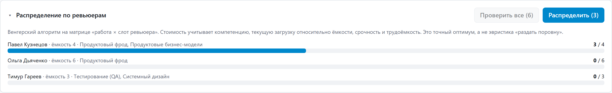

**«Распределить»** раскладывает работы по ревьюерам венгерским алгоритмом:
учитываются компетенции, текущая загрузка относительно ёмкости, срочность и
трудоёмкость. График показывает нагрузку до и после.

Рядом — **«Проверить все (N)»**: массовый запуск проверки моделью по всему
заданию.

#### 5. Работы и выгрузка

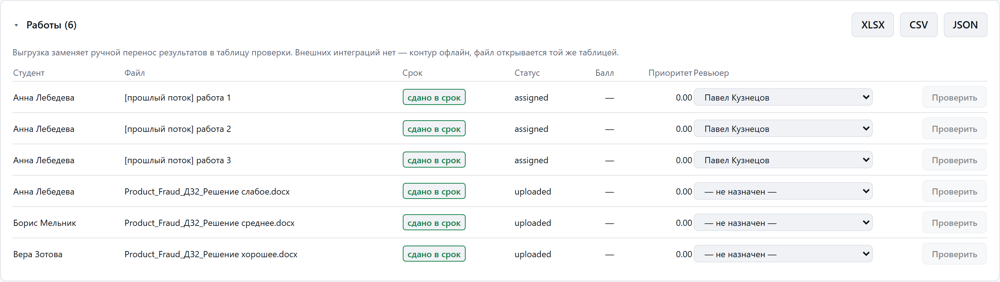

Таблица всего потока: студент, файл, срок, статус, балл, приоритет,
назначенный ревьюер. Кнопка **«Проверить»** в строке запускает проверку
одной работы. Сверху — выгрузка в XLSX, CSV и JSON.

---

### Ревьюер

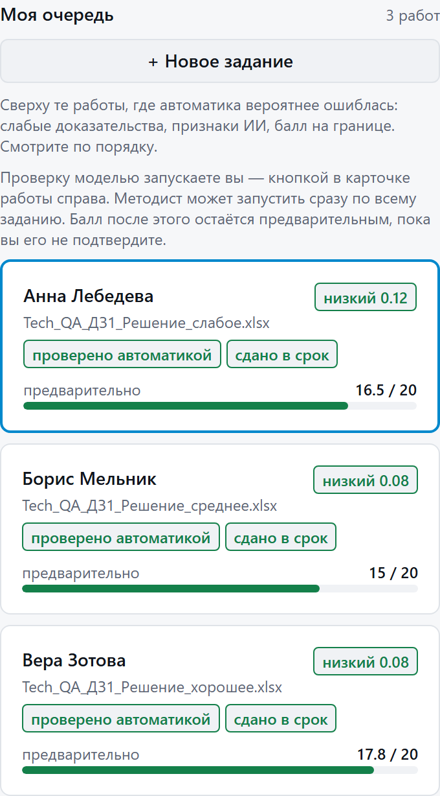

Слева очередь, отсортированная по тому, насколько вероятно ошиблась
автоматика: слабые доказательства, признаки ИИ, балл на границе. Смотреть
сверху вниз.

Кнопка **«+ Новое задание»** над очередью: ревьюер тоже может завести
типовое ДЗ, которое студенты увидят при сдаче.

#### Карточка работы

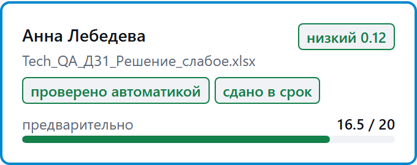

Справа вверху — предварительный балл и кнопка **«Проверить заново
моделью»**. Проверка идёт в фоне 45–120 секунд, результат приходит
уведомлением. Ниже объяснение, почему работа оказалась наверху очереди.

**Формальные проверки** — слой без модели: объём, шрифт, кегль, интервал,
формат, структура, история правок.

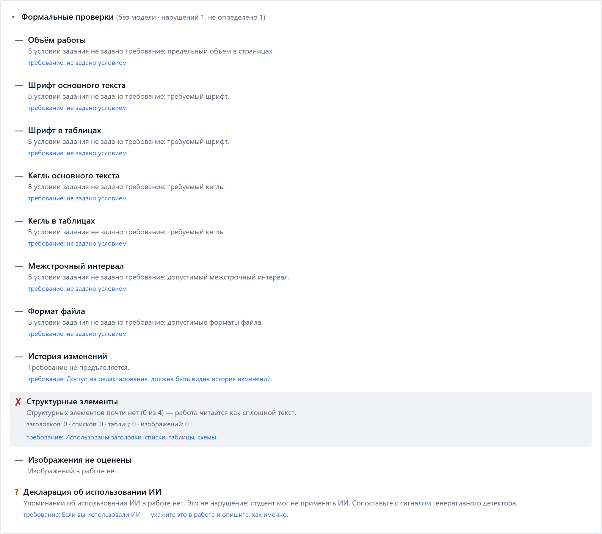

У каждой проверки четыре состояния, а не два: ✔ соблюдено, ✘ нарушено,
**? не определено** (данных в файле нет) и **— не применимо** (условие
такого требования не задаёт). Это важная деталь: требование, которого нет
в условии, не может быть нарушено.

**Оценка по критериям** — балл по каждому критерию с цитатами из работы.

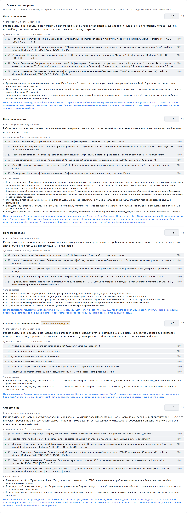

Цитаты проверены **кодом**: галочка означает, что цитата действительно
найдена в указанном блоке работы. Не найдена — критерий помечается как
неподтверждённый, и работа поднимается в очереди, но балл не снижается.
Любой балл можно изменить руками.

**Признаки генеративного ИИ** — отдельный сигнал.

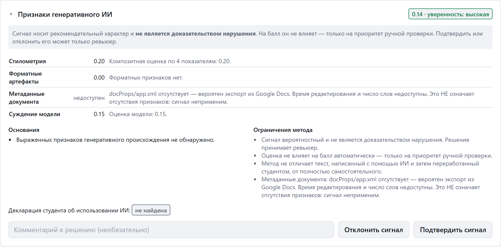

Четыре независимых источника, уровень уверенности, основания и ограничения
проверки. Сигнал **не влияет на балл** — это требование кейса. Ревьюер может
подтвердить его или отклонить.

**Документ с подсветкой** — сама работа с четырьмя слоями: доказательства,
признаки ИИ, нарушения, персональные данные.

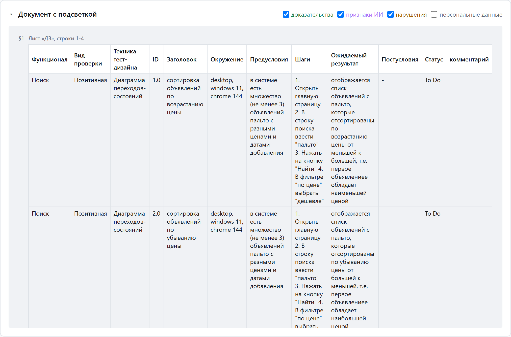

Таблицы показываются таблицами, заголовки — заголовками, диаграммы и код —
моноширинным блоком. Слева номер блока `§N` — на него ссылаются цитаты.

**Итоговое решение** — то, ради чего всё остальное.

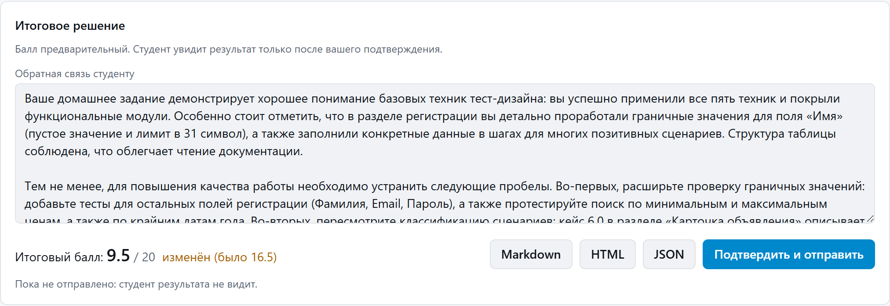

Балл, обратная связь студенту и кнопка **«Подтвердить и отправить»**. До
нажатия студент не видит ничего.

---

### Студент

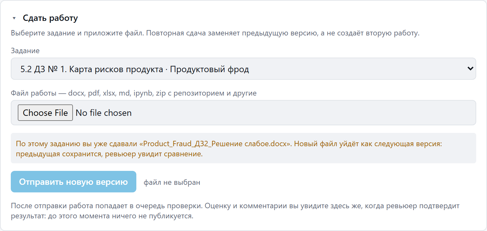

Выбрать задание, приложить файл, отправить. Если нужного задания в списке
нет, есть пункт **«своя тема: указать название самому»** — карточка задания
создастся автоматически, но критерии для неё должен будет описать ревьюер
или методист.

Повторная сдача заменяет предыдущую версию, а не создаёт вторую работу:
ревьюер увидит сравнение по критериям.

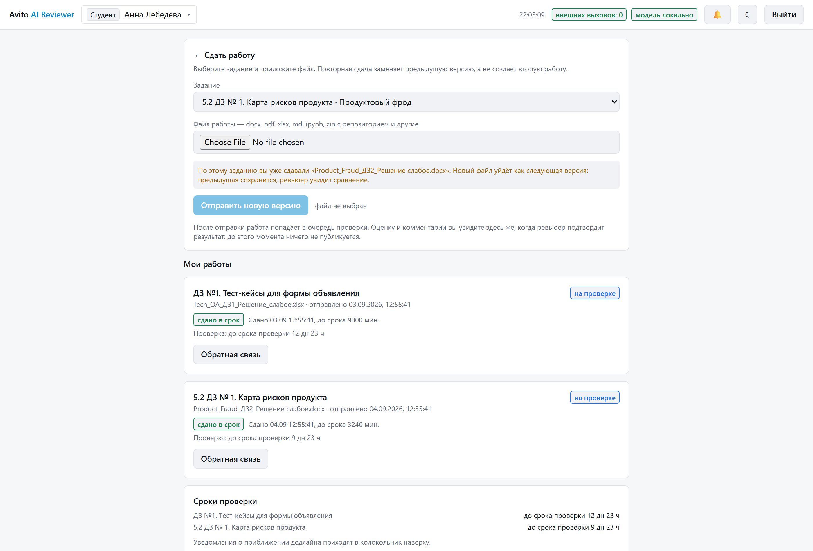

Ниже — свои работы, сроки, оценка и обратная связь после подтверждения
ревьюером. Плюс личный прогресс: динамика баллов и профиль по критериям.

---

### Качество и приватность

Две вкладки в шапке, доступные методисту и ревьюеру.

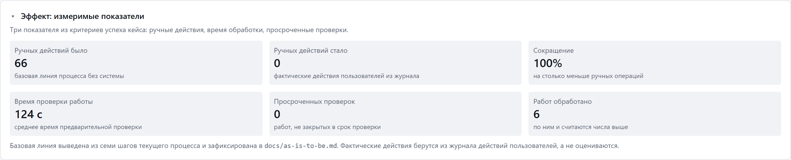

**«Качество»** — сначала измеримые показатели эффекта: сколько ручных
действий было и стало, время обработки работы, просроченные проверки. Это
прямой ответ на критерий успеха кейса.

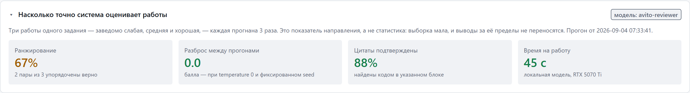

Ниже — результаты контрольного прогона: ранжирование, разброс между
прогонами, доля подтверждённых цитат. Показана и **неудачная пара** тоже:
цифра, которую прячут, перестаёт быть аргументом.

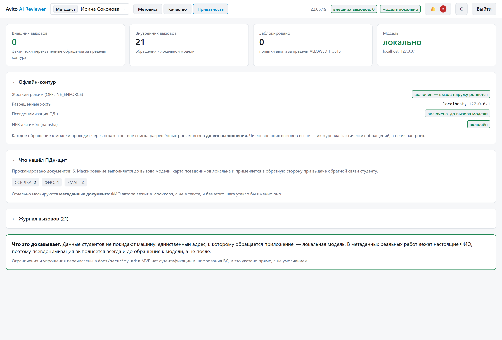

**«Приватность»** — счётчик внешних вызовов из аудита (а не декларация),
журнал обращений и находки ПДн-щита.

---

## Часть 2. Как показывать жюри

Восемь минут, три вкладки. Жюри просило показать, **как загружается ДЗ и как
оно проверяется** — на это и построен сценарий.

### Подготовка за пять минут до выхода

```powershell
# 1. Проверить модель
powershell -ExecutionPolicy Bypass -File scripts\ollama_setup.ps1

# 2. Пересоздать данные (критерии основного ДЗ останутся НЕутверждёнными —
#    так надо, их утверждение показывается живьём)
python -m app.seed --reset

# 3. Запустить
powershell -ExecutionPolicy Bypass -File scripts\run.ps1
```

Открыть **три вкладки** на `http://127.0.0.1:8000` и войти:

| Вкладка | Логин | Роль |
|---|---|---|
| 1 | `sokolova.i` | методист |
| 2 | `gareev.t` | ревьюер |
| 3 | `lebedeva.a` | студент |

Проверить перед началом: в шапке горит зелёное **«внешних вызовов: 0»** и
**«модель локально»**. Если нет — модель не поднялась, показывайте по
заранее проверенным работам второго курса и скажите об этом честно.

### Сценарий

**0:00–0:40 · Вкладка 1. Что это.**
Показать шапку: три роли, счётчик внешних вызовов — ноль.
> «Три роли, одна система. Наверху счётчик внешних вызовов: ноль. Это не
> декларация, а число из аудита — контур офлайн, единственный сетевой адрес
> это локальная модель на этой машине.»

**0:40–1:40 · Вкладка 1. Откуда берутся критерии.**
Раскрыть «Критерии оценивания». Показать, что критерии, максимумы, требования
к оформлению и срок извлечены из файла условия.
> «Загружено условие домашнего задания. Пять критериев с максимумами 1-4-2-2-1,
> объём, шрифт, кегль, интервал, срок сдачи и правило штрафа — всё вытащено
> автоматически. Числа берёт код регулярками, названия — модель: цифры в
> условии однозначны, доверять здесь модели незачем.»

Показать рядом кнопку «Написать текстом».
> «Если файла условия нет — требования можно просто написать текстом.»

**1:40–2:00 · Вкладка 1. Человек утверждает.**
Нажать **«Утвердить критерии»**.
> «Это черновик. Пока критерии не утверждены, проверка **не запускается** —
> ошибка в критериях исказила бы баллы всех работ разом. Утверждает человек.»

**2:00–2:40 · Вкладка 3. Студент сдаёт работу.**
Переключиться на вкладку студента, выбрать задание, приложить файл из
`data/примеры_домашек/product_fraud/`, отправить.
> «Работу сдаёт студент, сам. Файл может быть документом, таблицей,
> ноутбуком или репозиторием в архиве — тридцать одно расширение.»

Вернуться на вкладку 1: работа появилась в таблице без перезагрузки.
> «У методиста она появилась сразу — приложение живое, без опроса сервера.»

**2:40–3:20 · Вкладка 1. Распределение.**
Показать график нагрузки, нажать **«Распределить»**.
> «Павел уже загружен на три работы из четырёх, Ольга свободна, Тимур
> проверяет другие курсы. Венгерский алгоритм: это точный оптимум задачи о
> назначении, а не «раздать поровну».»

**3:20–4:00 · Вкладка 1. Запуск проверки.**
Нажать **«Проверить все»**.
> «Проверку запускает человек — не система при загрузке. Работа уходит в
> фон, 45–120 секунд. Пока считает, покажу уже проверенную работу второго
> курса.»

**4:00–6:00 · Вкладка 2. Ревьюер — главный экран.**
Здесь основное время.

1. Очередь: отсортирована по вероятности ошибки автоматики.
2. Формальные проверки: показать статус **«не определено»** и **«не
   применимо»**.
   > «Четыре статуса, а не два. У этой работы межстрочный интервал не задан
   > ни в параграфах, ни в стилях — честный ответ «не определено». Считать
   > отсутствие данных нарушением значило бы оштрафовать корректную работу.»
3. Критерии: раскрыть один, показать цитаты с процентами.
   > «Модель обязана вернуть номер блока и дословную цитату — и только их.
   > Статус «подтверждено» ставит **код**, найдя цитату в указанном блоке.
   > Модель физически не может объявить свою проверку пройденной.»
4. Нажать «показать» у цитаты — документ прокрутится к нужному блоку.
5. Признаки ИИ: показать уверенность, основания и ограничения.
   > «Сигнал не влияет на балл ни при каком положении настроек — это прямое
   > требование кейса. Ревьюер может его отклонить.»

**6:00–6:40 · Вкладка 2. Подтверждение.**
Изменить один балл, нажать **«Подтвердить и отправить»**.
> «Решение принимает человек. До этой кнопки студент не видит ничего.»

**6:40–7:10 · Вкладка 3. Что увидел студент.**
Обновить вкладку студента: появилась оценка и обратная связь.
> «Студент получил балл и персональную обратную связь — не шаблон, а разбор
> его работы по критериям.»

**7:10–7:40 · Вкладка 1. Вкладка «Качество».**
> «Показатели эффекта: ручных действий было столько, стало столько.
> Ниже — контрольный прогон на трёх работах разного уровня, включая пару,
> которую система **не** разделила. Мы её показываем, а не прячем.»

**7:40–8:00 · Вкладка «Приватность».**
> «Ноль внешних вызовов за всё время показа. Персональные данные
> псевдонимизируются до обращения к модели — вот что нашёл щит.»

### Если что-то пошло не так

| Что случилось | Что делать |
|---|---|
| Модель не отвечает | Работы второго курса уже проверены заранее. Показывать их и сказать прямо: «проверка выполнена до демонстрации, чтобы не тратить ваше время на ожидание» |
| Проверка не запускается | Не утверждены критерии — посмотрите на значок рядом с выбором задания |
| Сроки выглядят просроченными | Нажать «Вернуть обычные сроки» в блоке «Сроки и штрафы» |
| Интерфейс не открылся | `python -m app.cli review <работа> -c <условие>` — то же ревью в консоли |
| Данные испорчены показом | `python -m app.seed --reset` — 5 минут вместе с извлечением критериев |

### Заготовленные ответы

**«Почему локальная модель, а не GPT-4?»**
Кейс запрещает передачу персональных данных и внутренних материалов во
внешние сервисы. Локальная модель — не компромисс, а выполнение требования.
Слой провайдеро-независимый: смена на облако — правка `.env`, не кода.

**«Насколько модели можно доверять?»**
Ровно настолько, насколько её ответ проверяется кодом. 88 % цитат
подтверждены программно. Балл предварительный, решение принимает человек.

**«Что, если модель ошибётся?»**
Есть трасса выполнения: видно, какие шаги отработали, какие отказали.
Отказавший шаг не роняет проверку, а поднимает работу в очереди ручного
просмотра. Работу, которую не удалось прочитать, система отвергает, а не
оценивает.

**«Масштабируется ли на другие курсы?»**
Второй курс в демонстрации — технический QA, другой формат работ и другой
максимум балла. Проверено на восьми каталогах примеров кейса: 83 файла
разбираются без ошибок.
